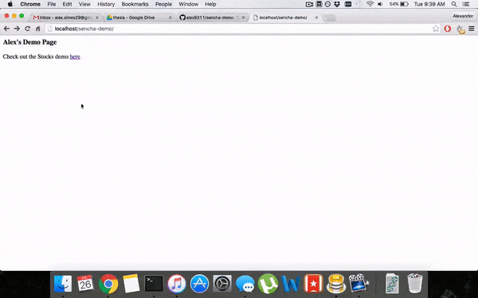

#Sencha Demo
I use Sencha's EXTJS 5.1, a slightly older version than what is currently available from [Sencha](https://www.sencha.com/products/extjs/#overview)

Repo should be cloned with the command:

`git clone --recursive https://github.com/alex9311/sencha-demo.git`

The build directories are gitignored so you will need [Sencha CMD](https://www.sencha.com/forum/showthread.php?297477-Sencha-Cmd-5.1.1-GA-is-Now-Available) to rebuild them after cloing. I believe Sencha CMD will complain if a version other than 5.1.1 is used, since that is the ext version used here.

###Stocks Application


The app shows data for a set of American stocks. The data is loaded from yahoo finance upon each page load or data reload.

After cloning the repo, run the following to rebuild the build folder to get the application working

```
cd stocks
sencha app build
```
See the [application-specific README file](stocks/Readme.md) for an overview of the source code.

